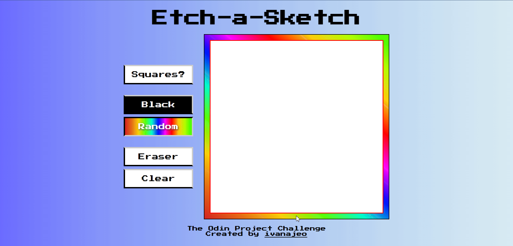

# Etch-a-Sketch 2.0 — Interactive Drawing on Hover!🌟

Unleash your inner artist — one pixel at a time.  
This modern reimagination of the classic **Etch A Sketch** lets you paint with nothing but a mouse hover. 
Fast, fluid, and oddly satisfying.

## Live Demo🚀
[Click here to view the live demo](https://etch-a-sketch-hazel-three.vercel.app/)

## Preview


## How It Works
Just hover your mouse over the canvas and **watch it come to life**.  
No clicks. No mess. Just instant creative expression.

## Features
| Tool      | Description                                                                 |
|-----------|-----------------------------------------------------------------------------|
| `Squares?` | Define the canvas grid size (e.g., 16 = 16x16). Max: **100x100**. Smaller squares = finer detail. |
| `Black`     | Set the brush color to classic **black** (default).                         |
| `Random`🌈  | Each stroke becomes a surprise — totally random colors!                    |
| `Eraser`    | Hover to erase previously painted squares.                                |
| `Clean`     | Wipe the canvas clean and start fresh.                                     |

## Getting Started
1. **Clone the repo**  
   ```bash
   git clone https://github.com/ivanajeo/etch-a-sketch.git
   cd etch-a-sketch
   ```
2. **Open** `index.html` **in your browser** <br />
   No build tools. No setup hell. It just works

## Tech Stack
- **Vanilla JavaScript** — for all DOM manipulation and logic
- **CSS Flexbox** — to build a responsive grid-based “canvas”
- Clean, semantic **HTML**

## License
MIT📜 — feel free to use, remix, and share.

## About This Project
This project is part of the Foundations curriculum from The Odin Project.  
It was built to practice DOM manipulation, event handling, and dynamic styling using vanilla JavaScript.
